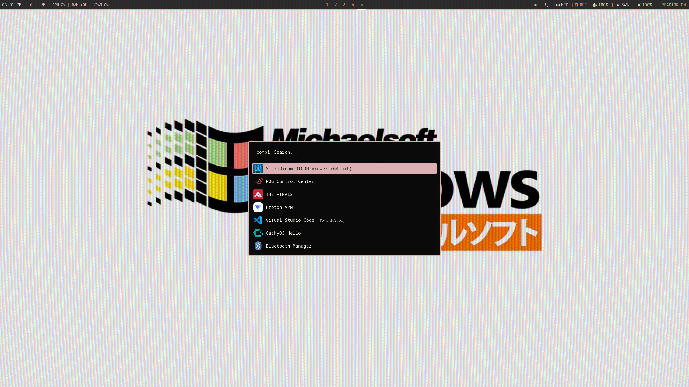
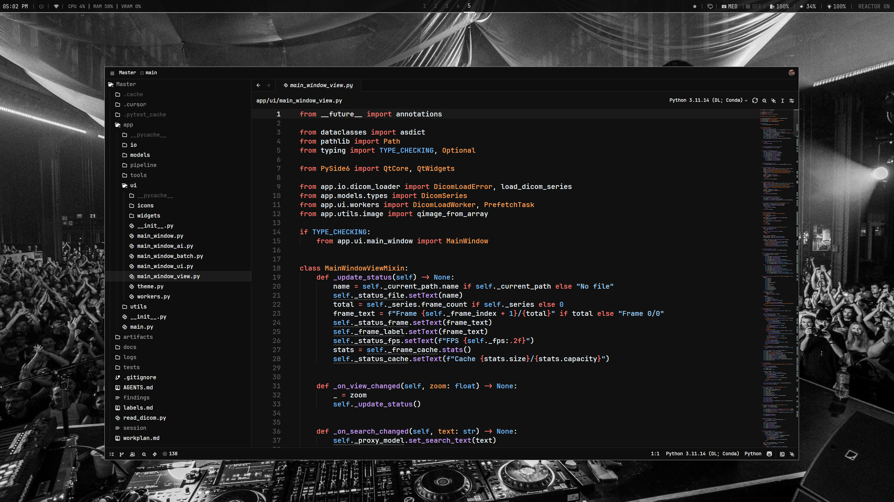
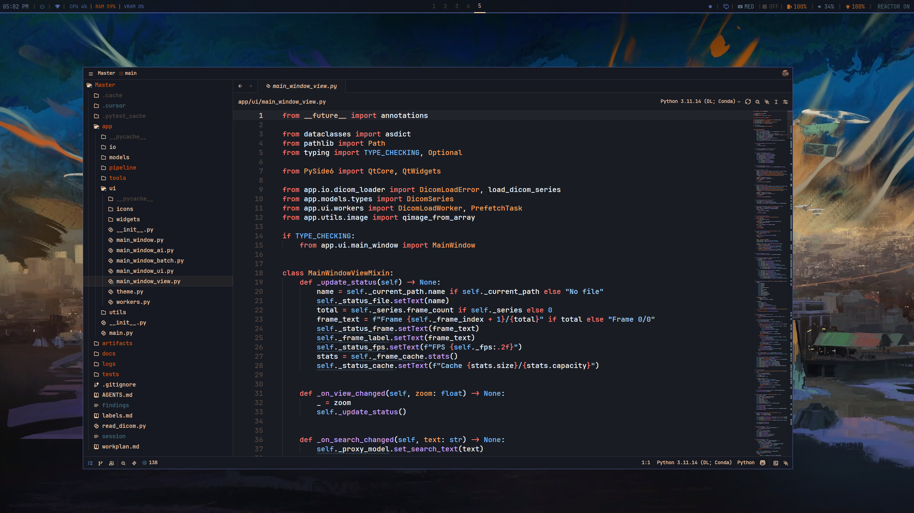

# Dotfiles

My Arch Linux dotfiles using Hyprland, Stow, and Zsh.

## Screenshots





## Packages

| Category | Packages |
|----------|----------|
| **WM/Desktop** | hypr, waybar, rofi, wofi, eww, swaync, swaylock, wlogout |
| **Terminal** | alacritty, ghostty |
| **Shell** | home/.zshrc, home/.zshenv, home/.zprofile |
| **Editor** | nvim, zed, Code |
| **System** | btop, fastfetch, cava, equibop |
| **Theming** | wal (pywal templates), gtk-3.0, gtk-4.0 |
| **Apps** | dolphin, google-chrome, mozilla, mpv, spotify |

## Stow

This repo uses **GNU Stow** to manage dotfiles. Files in `home/` get symlinked to `~/`.

```bash
# Install
sudo pacman -S stow

# First time setup
git clone <repo> ~/.config
cd ~/.config
stow -v -t ~ home

# Update symlinks after changes
stow -R -t ~ home

# Making changes - just edit normally!
# ~/.zshrc is a symlink to ~/.config/home/.zshrc
```

## Quick Install

```bash
# Arch
sudo pacman -S stow git zsh alacritty hyprland waybar rofi python-pywal neovim btop fastfetch

# Clone & stow
git clone <repo> ~/.config
cd ~/.config
stow -v -t ~ home

# Set zsh
chsh -s $(which zsh)

# Optional: pywal
wal -i /path/to/wallpaper.jpg
```

## Structure

```
.config/
├── home/           → ~/. (zshrc, gitconfig, etc)
├── alacritty/     → ~/.config/alacritty
├── hypr/          → ~/.config/hypr
├── nvim/          → ~/.config/nvim
└── ...
```

## Notes

- Zsh uses zinit with lazy loading (~50-100ms startup)
- Pywal generates colors from wallpaper for alacritty, hypr, waybar
- Edit any file directly - changes are tracked via symlinks
